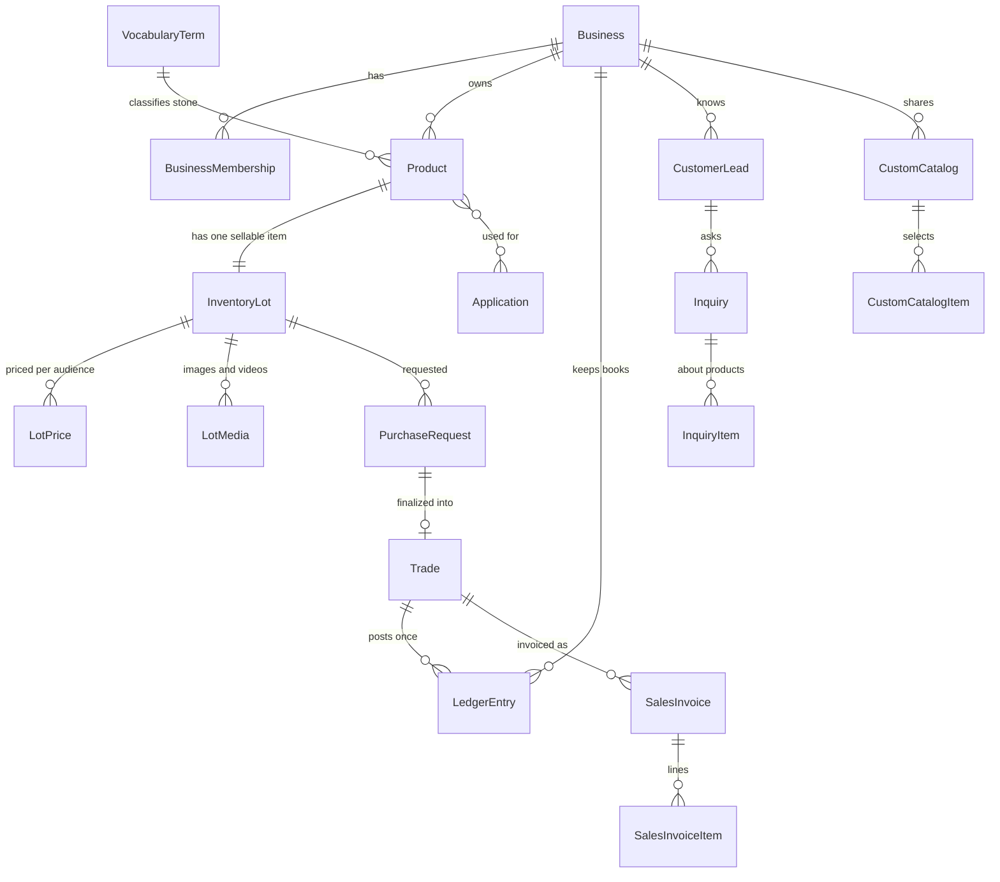

# Data Model — سنگا (SANGA)

Fields worth explaining are explained. Everything else is in the models, which
are the authority; this document exists for the decisions the field names do not
convey.

## 1. Overview

## 2. Business

| Field | Note |
|-------|------|
| `status` | active / suspended. A suspended business neither sees the marketplace nor appears in it. |
| `verification_status` | Platform trust. Deliberately independent of `status`. |
| `plan` | `browse` or `seller`. See [permissions.md](./permissions.md) §3.1. |
| `seat_limit` | Active memberships allowed. Checked when adding a member, not at login. |
| `active_until` | **Null means no expiry, not expired.** |

`Warehouse` still exists for migration history but inventory no longer references
it.

## 3. Product and InventoryLot

`Product` and `InventoryLot` separate descriptive fields from sellable state but
are one-to-one and edited as one user object. A second inventory item receives a
new Product row rather than sharing a reusable definition.

The four lifecycle axes, which never share a field:

| Field | Question |
|-------|----------|
| `is_visible` | Should the seller publish this at all? |
| `availability_status` | Is it offered for sale right now? |
| `stock_confirmed_at` + `stock_valid_for_days` | Do we trust the quantity? |
| `deleted_at` | Should it still exist as an active business object? |

`status` survives with two values, `draft` and `active`, meaning only "has the
seller finished creating it". It had nine in v1, including two dead
reservation states.

Other fields worth a note:

| Field | Note |
|-------|------|
| `stone` | FK to the admin-controlled stone vocabulary. |
| `name_suffix` | Optional seller-entered part; `commercial_name` is derived. |
| `lot_code` | Global, immutable stone prefix plus six random safe characters. |
| `available_sqm` | Nullable; null means inquiry, numeric means exact confirmed stock. |
| `stock_expires_at` | Derived **on write**, so "which items need a check?" is an indexed query. Nothing rewrites it on a timer. |
| `public_token` | Opaque, stable share identifier. Not the primary key: share links get pasted into WhatsApp. |

`Application` is a platform-wide controlled vocabulary. It replaced a free-text
JSON list, because a primary search facet backed by unvalidated text cannot work.

## 4. LotPrice

Two rows per item at most: `b2b` and `b2c`, independent of each other.

| Field | Note |
|-------|------|
| `mode` | `fixed` or `inquiry`. A check constraint forbids fixed-without-amount. |
| `amount` | Null in inquiry mode, so «استعلام قیمت» and «رایگان» stay distinguishable. |
| `price_confirmed_at` / `price_valid_for_days` | Independent of stock validity. |
| `price_expires_at` | Derived on write, same reasoning as stock. |
| `special_amount` / `special_until` | **Per tier**, so the audience gate protects it. On the item it would be an unlabelled number outside that gate. |

`ContactPrice` was removed in V2.

## 5. Trading

`PurchaseRequest` always references one `InventoryLot`. There is no free-form
demand; the FK is not nullable.

Requested and agreed values are separate columns (`requested_qty_sqm` versus
`final_qty_sqm`, and the same for price), because "you asked for 200 at 1.5m, I
can do 180 at 1.6m" is the normal conversation and both halves matter afterwards.

`Trade` is a commercial **header**; `TradeItem` carries the lines. One sale is
one Trade, one total, one entry in each party's book and one invoice, however
many stones it covered — a seller who sells travertine, marble and crystal in one
phone call is doing one deal, and recording it as three produced three invoices
and three balances to reconcile.

Each `TradeItem` carries its own `product_name`, `stone_type`, `grade`,
`quantity`, `unit_price` and `line_total` **snapshots**. Nothing on a trade page
reads through `item`, which is `SET_NULL` on both the header and the line and
exists for navigation only.

`Trade.product_name`, `stone_type`, `grade`, `quantity_sqm`, `unit_price` and
`item` are **legacy single-line columns**. They predate `TradeItem`, are still
written for a one-line sale — every historical row and every request-driven sale
— and are blank on a multi-line trade. New readers go through `items`; removing
them is a later change.

`Trade.submission_id` plus `uniq_trade_per_submission` (partial, scoped by
seller) make one direct-sale submission at most one sale. Finalizing a request is
idempotent through the `OneToOneField` to it; a direct sale has no request, so it
needed its own key.

`PurchaseRequest.ALLOWED_TRANSITIONS` enumerates every status change the product
performs, and each one is applied to a row re-read under `select_for_update()`.
See [trading.md](./trading.md) §7.

## 6. Accounting

`LedgerEntry` is immutable: `save()` raises on update, `delete()` raises
unconditionally.

| Field | Note |
|-------|------|
| `counterparty_business` | The colleague. V2's replacement for `contact`. |
| `contact` / `legacy_counterparty_name` | Pre-V2 rows whose Contact had no linked Business. Read-only; never posted to again. |
| `balance_delta` | Signed; the single source of truth for balance math. |
| `balance_after` | Stored running total, computed under a row lock. **Never recomputed**, including by migrations. |
| `reversed_at` | A bookkeeping flag, not financial data. The one carve-out from immutability, written with a queryset `.update()`. |
| `related_trade` | The authoritative link for a V2 sale. |

Two partial unique constraints give exactly-once posting:
`uniq_trade_entry_per_trade` (V2) and `uniq_trade_entry_per_offer` (legacy).
Both are scoped to live, non-reversed trade rows, so reversing frees the slot.

## 7. Invoicing

`SalesInvoice` and `SalesInvoiceItem` are snapshot-bearing. Every commercially
meaningful value is copied at issue time.

| Field | Note |
|-------|------|
| `number` | Sequential per seller, allocated under a lock, derived from MAX so cancelling never reuses one. |
| `buyer_name` | Snapshot, so a later rename does not rewrite the document. |
| `counterparty_type` | `business` or `customer`, with a check constraint keeping `buyer_business` consistent. |

## 8. Inquiries

`CustomerLead` is identity by `(business, phone)`. It is **not an account**: no
password, no session, no membership. `phone_verified_at` records that the number
was reachable at that moment. Category, CRM status, tags and current needs are
durable profile fields on this tenant-scoped identity.

`CustomerNote` is append-only seller context for one lead. `CustomerFollowUp`
stores the scheduled action, priority, status, reminder time and completion
result. `FollowUpReminderRead` records reminder read state per staff user. The
repository always filters these records through the active Business.

`Inquiry` is the request; `InquiryItem` is one product plus the metres needed.
Lines keep a `product_name` snapshot, because an inquiry is often *why* the
product then changes.

## 9. Catalogs

`CustomCatalogItem` is an explicit ordered membership. Catalog creation may use
a short-lived filter selection, but no mode, rule JSON or inclusion state is
stored on the catalog.

Resolution is live and intersected with `eligible_items()`. See
[catalogs.md](./catalogs.md).

## 10. Retired tables

| Table | Why it survives |
|-------|-----------------|
| `contacts.Contact` | `LedgerEntry.contact` is a PROTECT FK holding pre-V2 rows |
| `purchase_requests.*` | `LedgerEntry.related_offer` still points at `PurchaseOffer` |
| `businesses.Warehouse` | `inventory.0005` copied its addresses onto items; the model outlives its UI |

All read-only, all registered read-only in Django admin, none reachable from the
interface.
