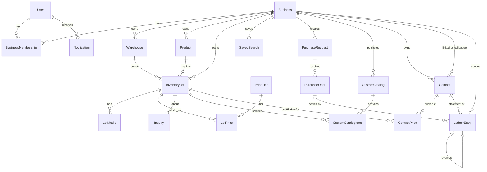

# Data Model — سنگا (SANGA)

## 1. Design Principles

- Prefer explicit FKs and DB constraints over implicit conventions.
- Money = `Decimal` + explicit `currency` (never float).
- Tenant-sensitive tables include `business` (or strict ownership chain).
- Product ≠ InventoryLot.
- Prices live in `pricing` domain, not as insecure template-only fields.
- Soft operational states via status enums; archive rather than hard-delete when historically meaningful.

## 2. Entity Relationship Overview

The diagram below lists **only models that exist in code today**. Anything planned
but unbuilt lives in §11, never here.

## 3. Core Entities

### accounts.User

| Field | Notes |
|-------|-------|
| id (UUID) | Immutable public identifier |
| phone | Unique, primary login identifier |
| email | Optional |
| full_name | Display name |
| is_active / is_staff / is_superuser | Django auth |
| date_joined / last_login | Standard |

Related: `OTPChallenge`. (There is no `UserSessionDevice` model; per-device session
tracking is not built.)

### businesses.Business

| Field | Notes |
|-------|-------|
| id (UUID) | |
| name | Commercial name |
| slug | Unique public storefront slug |
| status | active/suspended |
| verification_status | unverified/pending/verified/rejected/suspended |
| city / province / address | Location |
| phone / website | Contact |
| logo | Media |
| onboarding_step / onboarding_completed_at | Guided onboarding |
| settings (JSON) | Confirmation interval, auto-hide, etc. |

### businesses.BusinessMembership

| Field | Notes |
|-------|-------|
| user | FK |
| business | FK |
| role | owner / manager / staff / viewer (defaults) |
| permissions | JSON/Array of capability codes |
| status | invited / active / suspended |
| joined_at | |

Unique: `(user, business)`.

### businesses.Warehouse

| Field | Notes |
|-------|-------|
| business | FK |
| name | |
| city | |
| address | |
| is_active | |
| is_default | One default per business preferred |

### inventory.Product

Stable stone identity owned by a business (or later platform-shared catalog — not required initially; start per-business products).

| Field | Notes |
|-------|-------|
| business | FK |
| commercial_name | |
| slug | Unique per business |
| stone_type | e.g. تراورتن، مرمریت |
| quarry_region | |
| primary_color | |
| pattern / vein_notes | |
| applications | M2M or JSON list |
| interior_suitable / exterior_suitable | bool |
| technical_notes | |
| description_public | B2C-friendly |
| description_professional | B2B-oriented |
| alt_names | search aliases |
| is_active | |

### inventory.InventoryLot

Physical batch.

| Field | Notes |
|-------|-------|
| id (UUID) | |
| business | FK (denormalized for tenant scoping) |
| product | FK |
| warehouse | FK |
| lot_code | Unique per business |
| status | draft/available/reservation_pending/reserved/partially_sold/sold/expired/hidden/needs_confirmation (the two reserved states are legacy: nothing sets them since reservations were removed) |
| visibility | `private` (داخلی) / `colleagues` (همکاران — every business with an account) / `public` (عمومی — colleagues **and** the storefront) |
| available_sqm / original_sqm | Decimal |
| slab_count / bundle_count | optional ints |
| length_cm / width_cm / thickness_mm | dimensions |
| grade | |
| processing_type | polished/honed/... |
| min_sale_qty | Decimal |
| ready_for_loading_at | date/datetime |
| photographed_at | |
| inventory_confirmed_at | freshness core |
| offer_expires_at | |
| description | |
| defect_notes | internal-capable; gate by audience |
| is_featured / is_urgent_sale | |
| created_at / updated_at | |
| archived_at | nullable |

Check constraints: quantities ≥ 0; available ≤ original.

### pricing.PriceTier

| Field | Notes |
|-------|-------|
| code | `b2b`, `b2c` initially |
| name | |
| is_active | |

### pricing.LotPrice

| Field | Notes |
|-------|-------|
| lot | FK |
| tier | FK |
| amount | Decimal(14,2) |
| currency | default IRR (or explicit) |
| unit | per_sqm / per_slab / inquiry_only |

Unique: `(lot, tier)`.

### pricing.ContactPrice

Contact-specific price: one number, one contact, one lot.

| Field | Notes |
|-------|-------|
| contact | FK `contacts.Contact` (tenant scoping rides on `contact.business`) |
| lot | FK `inventory.InventoryLot` |
| amount | Decimal(14,2) |
| currency | default IRR |
| unit | per_sqm / per_slab / inquiry_only |
| created_by / created_at / updated_at | audit trail for a commercial decision |

Unique: `(contact, lot)`. The service refuses unless
`contact.business_id == lot.business_id`. Visible only to the business named by
`contact.linked_business`, and only through the `b2b_partner` audience — see
[pricing.md](./pricing.md).

### inventory.LotMedia

| Field | Notes |
|-------|-------|
| lot | FK |
| kind | image/video |
| file | |
| thumbnail | |
| caption | |
| sort_order | |
| is_primary | |

## 4. Network & Demand Entities

There is **no relationship model between businesses**. `PartnerRelation` and
`SupplierFollow` were deleted: an account *is* the relationship, so lot visibility
is decided by `InventoryLot.visibility` alone. `matching.MatchResult` was deleted
with the scoring rule that produced it; sellers browse the demand board instead.
The `partners`, `matching` and `reservations` apps survive only as migration
history and hold no models.

### marketplace.SavedSearch

A stored marketplace filter (`business`, `user`, `name`, `query` JSON, notify
flag, last-matched/last-notified timestamps). Moved here from the removed
`partners` app; a Celery beat task re-runs the filters and notifies the owner.

### purchase_requests.PurchaseRequest

Structured demand from B2B users: stone type, color, qty, thickness, grade, budget,
destination city, required date, notes, status. It reaches the demand board only
when `is_public_to_network` is set. The `matching` status is legacy — nothing sets
it since automatic matching was removed, but existing rows keep it and the board
still accepts it.

### purchase_requests.PurchaseOffer

Private seller response to a PR (not public auction). Accepting one closes the
request and rejects the competing offers; it holds no stock. An accepted offer can
be settled into the ledger once per business — see `LedgerEntry.related_offer`.

## 5. Commercial Interaction Entities

### inquiries.Inquiry

Links: business, requester (user/customer), optional lot/catalog/PR, status pipeline (`new` → … → `converted/closed/lost`), assignee, timestamps.

### contacts.Contact

The CRM-lite record; there is **no** `customers.CustomerProfile` model (the
`customers.manage` capability code predates this app and still governs it).

| Field | Notes |
|-------|-------|
| business | FK — owning tenant; a contact is never visible to another business |
| display_name / phone / address / notes | |
| linked_business | Optional FK to any other **active** business; no approval involved |
| is_active | archive instead of delete |
| created_by / created_at / updated_at | |

There is **no relationship type**. Only stone sellers and traders hold accounts,
so every contact is a همکار who sometimes buys and sometimes sells; the former
`is_customer` / `is_supplier` / `is_trader` flags (and the "at least one required"
rule) were dropped in migration `contacts.0004_remove_contact_types`. Nothing keyed
off them — no report, price rule or ledger entry — so the values were not migrated
anywhere. The list is filtered by free-text search over name and phone.

An archived contact (`is_active = False`) disappears from the default contact list
but **not** from financial reporting while its balance is non-zero — see
[accounting.md](./accounting.md) §6.4. It stays reachable through the list's
«نمایش مخاطبین بایگانی‌شده» filter (`?archived=1`) and can be returned to the active
list from its detail page (`contacts:restore`, POST only). Archiving also suspends
that contact's `ContactPrice` overrides, so the archive confirmation screen names
how many negotiated prices will stop applying, and restoring brings them back.

Unique: `(business, linked_business)` where `linked_business` is not null
(`uniq_linked_business_per_business`) — one colleague maps to at most one contact,
so a colleague's balance can never split across two ledgers.

### accounting.LedgerEntry

Immutable per-contact ledger entry. Full semantics in
[accounting.md](./accounting.md).

| Field | Notes |
|-------|-------|
| business / contact | tenant + statement scope |
| entry_type | sale / purchase / payment_received / payment_made / adjust_debit / adjust_credit / reversal |
| amount | Decimal(14,2), positive magnitude, check constraint `> 0` |
| balance_delta | Decimal(14,2) signed — single source of truth for balance math |
| balance_after | Decimal(18,2) running balance, computed under a contact row lock |
| currency / description / reference / occurred_on | |
| related_lot / related_offer / reverses | optional links |
| reversed_at | set on the original when a reversal is posted (bookkeeping flag) |
| created_by / created_at | |

Constraints: `ledger_amount_positive`; `uniq_trade_entry_per_offer` on
`(business, related_offer)` for trade types with a non-null offer and
`reversed_at IS NULL`. `save()` blocks updates and `delete()` raises.

## 6. Catalog & Sharing

### catalog.CustomCatalog

title, business, customer optional, message, share_token, expires_at, is_active, view_count, first/last viewed.

### catalog.CustomCatalogItem

catalog ↔ lot ordering.

Public share URLs must use B2C-safe serializers only.

## 7. Platform Cross-Cutting

### notifications.Notification

user, business, kind, title, body, link, read state, timestamps. This is the only
model in the app — there is no `NotificationPreference` table; per-channel
preferences are not built.

### Not built (do not document as if they exist)

- **`audit.AuditEvent`** — there is no audit app or model. The `audit.view`
  capability code exists but currently gates nothing. Writes are traced through
  server-side logging only (`logger.info` in each service).
- **`businesses.BusinessVerificationDocument`** — `Business.verification_status`
  exists as a field; the document workflow does not.
- **analytics event tables** — the `analytics.view` capability code exists but is
  not checked anywhere yet, and there is no event table. The dashboard at `/app/`
  reads live rows through the existing selectors; it stores and aggregates nothing
  of its own.

## 8. Indexing Strategy (Initial)

- `(business, status)`, `(business, lot_code)` unique  
- `(business, inventory_confirmed_at)`  
- `(visibility, status, updated_at)` for marketplace feeds  
- `(product, status)`  
- GIN/trigram indexes for Persian search fields as needed  
- `(share_token)` unique on custom catalogs  

## 9. Soft Enum Catalog

Prefer TextChoices on models for:

- lot status, visibility  
- membership role/status  
- verification status  
- inquiry status  
- media kind  
- price unit  

## 10. Migration Policy

- Small, reviewable migrations per domain slice  
- No destructive data migrations without backup notes  
- Seed command: `python manage.py seed_demo`  

## 11. What We Deliberately Defer

- Shared global stone taxonomy marketplace-wide (can normalize later)
- Invoice/Order/Payment tables
- Complex KYC document graph (incl. `BusinessVerificationDocument`)
- Star ratings / reviews
- Audit event table (`AuditEvent`) and per-device session tracking
- A separate customer-profile table; `contacts.Contact` covers CRM-lite
- Reservations/holds and automatic matching (removed; trades are recorded manually)
- Squashing the migration history of the emptied `partners`, `matching` and
  `reservations` apps, which is why they are still in `INSTALLED_APPS`
