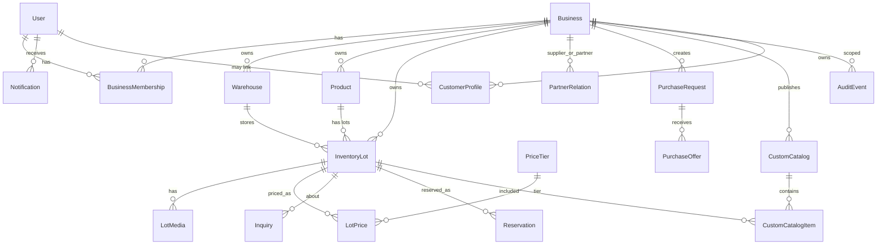

# Data Model — سنگا (SANGA)

## 1. Design Principles

- Prefer explicit FKs and DB constraints over implicit conventions.
- Money = `Decimal` + explicit `currency` (never float).
- Tenant-sensitive tables include `business` (or strict ownership chain).
- Product ≠ InventoryLot.
- Prices live in `pricing` domain, not as insecure template-only fields.
- Soft operational states via status enums; archive rather than hard-delete when historically meaningful.

## 2. Entity Relationship Overview

## 3. Core Entities

### accounts.User

| Field | Notes |
|-------|-------|
| id (UUID) | Immutable public identifier |
| phone | Unique, primary login identifier |
| email | Optional |
| full_name | Display name |
| is_active / is_staff / is_superuser | Django auth |
| date_joined / last_login | Standard |

Related: `OTPChallenge`, `UserSessionDevice` (optional Phase 1.5).

### businesses.Business

| Field | Notes |
|-------|-------|
| id (UUID) | |
| name | Commercial name |
| slug | Unique public storefront slug |
| status | active/suspended |
| verification_status | unverified/pending/verified/rejected/suspended |
| city / province / address | Location |
| phone / website | Contact |
| logo | Media |
| onboarding_step / onboarding_completed_at | Guided onboarding |
| settings (JSON) | Confirmation interval, auto-hide, etc. |

### businesses.BusinessMembership

| Field | Notes |
|-------|-------|
| user | FK |
| business | FK |
| role | owner / manager / staff / viewer (defaults) |
| permissions | JSON/Array of capability codes |
| status | invited / active / suspended |
| joined_at | |

Unique: `(user, business)`.

### businesses.Warehouse

| Field | Notes |
|-------|-------|
| business | FK |
| name | |
| city | |
| address | |
| is_active | |
| is_default | One default per business preferred |

### inventory.Product

Stable stone identity owned by a business (or later platform-shared catalog — not required initially; start per-business products).

| Field | Notes |
|-------|-------|
| business | FK |
| commercial_name | |
| slug | Unique per business |
| stone_type | e.g. تراورتن، مرمریت |
| quarry_region | |
| primary_color | |
| pattern / vein_notes | |
| applications | M2M or JSON list |
| interior_suitable / exterior_suitable | bool |
| technical_notes | |
| description_public | B2C-friendly |
| description_professional | B2B-oriented |
| alt_names | search aliases |
| is_active | |

### inventory.InventoryLot

Physical batch.

| Field | Notes |
|-------|-------|
| id (UUID) | |
| business | FK (denormalized for tenant scoping) |
| product | FK |
| warehouse | FK |
| lot_code | Unique per business |
| status | draft/available/reservation_pending/reserved/partially_sold/sold/expired/hidden/needs_confirmation |
| visibility | private/selected_partners/all_partners/customer_catalog/public |
| available_sqm / original_sqm | Decimal |
| slab_count / bundle_count | optional ints |
| length_cm / width_cm / thickness_mm | dimensions |
| grade | |
| processing_type | polished/honed/... |
| min_sale_qty | Decimal |
| ready_for_loading_at | date/datetime |
| photographed_at | |
| inventory_confirmed_at | freshness core |
| offer_expires_at | |
| description | |
| defect_notes | internal-capable; gate by audience |
| is_featured / is_urgent_sale | |
| created_at / updated_at | |
| archived_at | nullable |

Check constraints: quantities ≥ 0; available ≤ original (+ reservation accounting rules).

### pricing.PriceTier

| Field | Notes |
|-------|-------|
| code | `b2b`, `b2c` initially |
| name | |
| is_active | |

### pricing.LotPrice

| Field | Notes |
|-------|-------|
| lot | FK |
| tier | FK |
| amount | Decimal(12,2) |
| currency | default IRR (or explicit) |
| unit | per_sqm / per_slab / inquiry_only |

Unique: `(lot, tier)`.

### inventory.LotMedia

| Field | Notes |
|-------|-------|
| lot | FK |
| kind | image/video |
| file | |
| thumbnail | |
| caption | |
| sort_order | |
| is_primary | |

## 4. Network & Demand Entities

### partners.PartnerRelation

| Field | Notes |
|-------|-------|
| supplier_business | |
| partner_business | |
| status | requested/approved/rejected/blocked |
| can_see_selected_lots | for selected_partners visibility |
| created_at / decided_at | |

### partners.SupplierFollow

Follower user/business → supplier business.

### purchase_requests.PurchaseRequest

Structured demand from B2B users: stone type, color, qty, thickness, grade, budget, destination city, required date, notes, status.

### purchase_requests.PurchaseOffer

Private seller response to a PR (not public auction).

### matching.MatchResult (optional persisted)

Cached/generated matches between PR and lots for notification/review.

## 5. Commercial Interaction Entities

### inquiries.Inquiry

Links: business, requester (user/customer), optional lot/catalog/PR, status pipeline (`new` → … → `converted/closed/lost`), assignee, timestamps.

### reservations.Reservation

| Field | Notes |
|-------|-------|
| lot | |
| business | seller |
| requester | |
| quantity | Decimal |
| status | requested/approved/rejected/extended/cancelled/converted/expired |
| expires_at | |
| reason / notes | |
| timestamps | |

Quantity locking via transactions + `select_for_update`.

### customers.CustomerProfile

Lightweight CRM per business: name, phone, company, city, notes, source, linked user optional.

## 6. Catalog & Sharing

### catalog.CustomCatalog

title, business, customer optional, message, share_token, expires_at, is_active, view_count, first/last viewed.

### catalog.CustomCatalogItem

catalog ↔ lot ordering.

Public share URLs must use B2C-safe serializers only.

## 7. Platform Cross-Cutting

### notifications.Notification / NotificationPreference

### audit.AuditEvent

actor, business, entity_type, entity_id, action, old_values, new_values, ip/user_agent, created_at.  
Normal users cannot edit/delete.

### businesses.BusinessVerificationDocument (lightweight)

For pending verification workflow — keep minimal.

### analytics events

Start with derived queries + sparse event table; avoid heavy warehouse prematurely.

## 8. Indexing Strategy (Initial)

- `(business, status)`, `(business, lot_code)` unique  
- `(business, inventory_confirmed_at)`  
- `(visibility, status, updated_at)` for marketplace feeds  
- `(product, status)`  
- GIN/trigram indexes for Persian search fields as needed  
- `(share_token)` unique on custom catalogs  

## 9. Soft Enum Catalog

Prefer TextChoices on models for:

- lot status, visibility  
- membership role/status  
- verification status  
- inquiry/reservation statuses  
- media kind  
- price unit  

## 10. Migration Policy

- Small, reviewable migrations per domain slice  
- No destructive data migrations without backup notes  
- Seed command: `python manage.py seed_demo`  

## 11. What We Deliberately Defer

- Shared global stone taxonomy marketplace-wide (can normalize later)
- Invoice/Order/Payment tables
- Complex KYC document graph
- Star ratings / reviews
