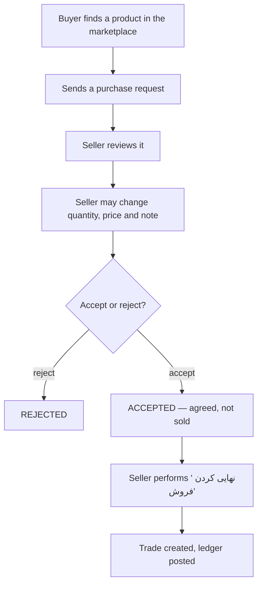

# Buying and Selling — سنگا (SANGA)

## 1. What replaced the demand board

v1 had a demand board: a buyer described what they wanted in free text, sellers
answered with private offers, and a matcher tried to pair them. It is gone.

Nothing about it produced a sale either side could point at. The buyer described
a stone; the seller guessed which of their products fitted; the "match" was an
opinion. Meanwhile the marketplace already showed every colleague's actual
products, so the buyer could simply look.

In V2 a purchase request **always references one existing product**. There is
nothing to match, because the buyer has already found the thing they want.

The old models (`purchase_requests.PurchaseRequest`, `PurchaseOffer`) stay as
read-only history: their rows are referenced by
`accounting.LedgerEntry.related_offer`. Nothing creates or edits one any more,
and there are no routes to them outside Django admin.

## 2. The workflow

### Accepting is not selling

The single most important rule here, and the reason the two steps exist.

`ACCEPTED` means "we agree on 40 m² at 1,600,000". It creates no `Trade`, posts
no ledger entry, and changes no stock. A preliminary agreement that never turns
into a shipment must not appear in anyone's books, and in this trade a good
number of them do not.

Finalizing is a separate, deliberate action with its own screen and its own
confirmation checkbox, because it is the point at which the seller's ledger
changes.

The UI never labels an accepted request as sold. The badge reads
«توافق شده — هنوز نهایی نشده», and the dashboard counts accepted-but-unfinalized
requests separately, because forgetting one is the natural failure mode of
splitting the steps.

### Exactly once

Finalization is the authoritative commercial event, so it has to happen exactly
once under a double-click, a retried POST, or two salespeople acting at the same
time. Three things enforce that together:

1. `PurchaseRequest` is locked with `select_for_update()` inside the
   transaction, so concurrent attempts serialize.
2. The second attempt sees `status=COMPLETED` and refuses.
3. `Trade.purchase_request` is a `OneToOneField`, so the database rejects a
   second trade for the same request even if the first two failed.

## 3. Stock is never decremented

Finalizing a sale does **not** subtract square metres.

SANGA is not the authoritative warehouse system and does not know whether this
was the only sale of that product — the same slabs may have been sold over the
phone an hour earlier. Silently decrementing would produce a number that looks
authoritative and is wrong.

Instead the trade page offers «به‌روزرسانی موجودی» as a convenience, and the
finalize screen says plainly that stock has not changed.

## 4. Trades are historical snapshots

`Trade` carries its own `product_name`, `stone_type`, `grade`, `quantity_sqm`,
`unit_price` and `total_amount`.

Nothing on a trade page is looked up through `item` at display time. Rename the
product, reprice it, mark it unavailable or delete it — the trade still reads
exactly as it did on the day it happened. The `item` FK exists for navigation
(«به‌روزرسانی موجودی»), not for rendering history, and it is `SET_NULL`.

Deleting a product that has trades archives it rather than purging it, so the
FK and the history behind it survive. See [inventory.md](./inventory.md) §9.

## 5. Direct sales

Most sales still happen over the phone. «ثبت فروش مستقیم»
(`/app/trading/direct-sale/`) creates a `Trade` without a purchase request, for
either a colleague Business or a walk-in customer identified by name and mobile.
It posts the ledger and issues the invoice in the same transaction, exactly as
finalizing a request does.

A walk-in customer is **never** a platform User. `Trade.counterparty_type`
distinguishes the two cases, and a check constraint keeps `buyer_business`
consistent with it.

Forcing sellers to invent a purchase request first would simply make them stop
recording sales.

### It is the only way to sell to a colleague outside a request

There used to be a second route: hand-typing a sales invoice with a colleague as
the buyer. It produced a valid-looking document and moved nobody's balance, so a
business could believe it had sold something the ledger had never heard of. That
route is gone — `create_manual_invoice()` refuses a colleague counterparty and
points here.

A direct sale describes **one product line**, because the Trade it creates
carries one snapshot and one Trade backs one invoice and one ledger entry per
party. A basket of different stones is several sales. Hand-typed multi-line
invoices remain available for walk-in customers, where no account moves.

## 6. Permissions and plan

| Action | Capability | Plan entitlement |
|--------|-----------|------------------|
| Send a purchase request | `purchase.request` | none — browse-only accounts can buy |
| Answer a request | `purchase.request` | `receive_purchase_requests` (seller) |
| Finalize a sale | `sale.finalize` | `finalize_sales` (seller) |

Both gates are enforced in `apps/trading/services.py`, never by hiding
navigation. The plan is re-read from the locked row at finalization time, so a
subscription that lapsed while the page was open still blocks the sale.

## 7. Notifications

Owners and managers of the receiving business are notified when a request
arrives, is accepted, is rejected, or is finalized. Deliberately not every
member: notifying a ten-person team about every request is how notification
lists get ignored.
