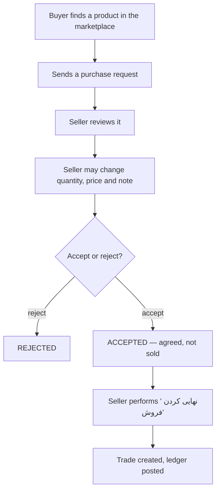

# Buying and Selling — سنگا (SANGA)

## 1. What replaced the demand board

v1 had a demand board: a buyer described what they wanted in free text, sellers
answered with private offers, and a matcher tried to pair them. It is gone.

Nothing about it produced a sale either side could point at. The buyer described
a stone; the seller guessed which of their products fitted; the "match" was an
opinion. Meanwhile the marketplace already showed every colleague's actual
products, so the buyer could simply look.

In V2 a purchase request **always references one existing product**. There is
nothing to match, because the buyer has already found the thing they want.

The old models (`purchase_requests.PurchaseRequest`, `PurchaseOffer`) stay as
read-only history: their rows are referenced by
`accounting.LedgerEntry.related_offer`. Nothing creates or edits one any more,
and there are no routes to them outside Django admin.

## 2. The workflow



### Accepting is not selling

The single most important rule here, and the reason the two steps exist.

`ACCEPTED` means "we agree on 40 m² at 1,600,000". It creates no `Trade`, posts
no ledger entry, and changes no stock. A preliminary agreement that never turns
into a shipment must not appear in anyone's books, and in this trade a good
number of them do not.

Finalizing is a separate, deliberate action with its own screen and its own
confirmation checkbox, because it is the point at which the seller's ledger
changes.

The UI never labels an accepted request as sold. The badge reads
«توافق شده — هنوز نهایی نشده», and the dashboard counts accepted-but-unfinalized
requests separately, because forgetting one is the natural failure mode of
splitting the steps.

### Exactly once

Finalization is the authoritative commercial event, so it has to happen exactly
once under a double-click, a retried POST, or two salespeople acting at the same
time. Three things enforce that together:

1. `PurchaseRequest` is locked with `select_for_update()` inside the
   transaction, so concurrent attempts serialize.
2. The second attempt sees `status=COMPLETED` and refuses.
3. `Trade.purchase_request` is a `OneToOneField`, so the database rejects a
   second trade for the same request even if the first two failed.

## 3. Stock is never decremented

Finalizing a sale does **not** subtract square metres.

SANGA is not the authoritative warehouse system and does not know whether this
was the only sale of that product — the same slabs may have been sold over the
phone an hour earlier. Silently decrementing would produce a number that looks
authoritative and is wrong.

Instead the trade page offers «به‌روزرسانی موجودی» as a convenience, and the
finalize screen says plainly that stock has not changed.

## 4. A trade is a header with lines

`Trade` is the commercial event; `TradeItem` is what was in it. One sale, one
total, one entry in each party's book, one invoice — however many stones it
covers.

```
Trade  ──┬── TradeItem (travertine, 100 m²)
         ├── TradeItem (travertine, 70 m²)
         └── TradeItem (marble, 50 m²)
   │
   ├── one seller SALE + one buyer PURCHASE, for the sum
   └── one SalesInvoice ── three SalesInvoiceItems
```

Each line carries its own `product_name`, `stone_type`, `grade`, `quantity`,
`unit_price` and `line_total`. Nothing on a trade page is looked up through
`item` at display time. Rename the product, reprice it, mark it unavailable or
delete it — the trade still reads exactly as it did on the day it happened. The
`item` FK exists for navigation («به‌روزرسانی موجودی»), not for rendering
history, and it is `SET_NULL`.

### The header's own snapshot columns are legacy

`Trade.product_name`, `stone_type`, `grade`, `quantity_sqm`, `unit_price` and
`item` predate `TradeItem`. They are still written for a **one-line** sale —
which is every historical row and every request-driven sale — so nothing that
already reads them broke, and they are blank on a multi-line trade, where
`items` is the only truth. New readers go through `items`. Removing them is a
separate, later change made once nothing reads them.

### Reports read the lines, and never both

Summing `Trade.total_amount` across a join to `TradeItem` multiplies a
three-line sale by three. So `sales_by_stone_type` and `sales_by_product`
aggregate `TradeItem.line_total`, while `sales_by_colleague` and `sales_summary`
take money from the header and metres from a separate line aggregate.

Deleting a product that has trades archives it rather than purging it, so the
FK and the history behind it survive. See [inventory.md](./inventory.md) §9.

## 5. Direct sales

Most sales still happen over the phone. «ثبت فروش مستقیم»
(`/app/trading/direct-sale/`) creates a `Trade` without a purchase request, for
either a colleague Business or a walk-in customer identified by name and mobile.
It posts the ledger and issues the invoice in the same transaction, exactly as
finalizing a request does.

A walk-in customer is **never** a platform User. `Trade.counterparty_type`
distinguishes the two cases, and a check constraint keeps `buyer_business`
consistent with it.

Forcing sellers to invent a purchase request first would simply make them stop
recording sales.

### It is the only way to sell to a colleague outside a request

There used to be a second route: hand-typing a sales invoice with a colleague as
the buyer. It produced a valid-looking document and moved nobody's balance, so a
business could believe it had sold something the ledger had never heard of. That
route is gone — `create_manual_invoice()` refuses a colleague counterparty and
points here.

A direct sale takes **as many product lines as the sale had**. It used to take
one, so a seller who sold a colleague travertine, marble and crystal in one phone
call had to record three sales — producing three invoices, three ledger entries
and three balances to reconcile for one commercial event. The workaround for a
modelling gap was worse bookkeeping than the gap.

### It is idempotent

The form mints a `submission_id` before the seller submits, and
`uniq_trade_per_submission` makes one submission at most one sale. A
double-click, a refresh, a reverse proxy retrying a timed-out POST and two open
tabs all carry the same token and all resolve to the same Trade.

This matters more here than anywhere else in SANGA. Finalizing a request is
idempotent for free, because `Trade.purchase_request` is a `OneToOneField` and
the request's row is locked; a direct sale has no request, so it inherited
neither protection and two submissions produced two genuinely distinct trades —
satisfying every per-trade constraint while moving the colleague's balance twice.

A retry also re-attempts the invoice. Invoicing is best-effort by design, so a
lapsed entitlement or a transient failure can leave a finalized sale without a
document, and the retry is the natural moment to heal it.

## 6. Permissions and plan

| Action | Capability | Plan entitlement |
|--------|-----------|------------------|
| Send a purchase request | `purchase.request` | none — browse-only accounts can buy |
| Answer a request | `purchase.request` | `receive_purchase_requests` (seller) |
| Finalize a sale | `sale.finalize` | `finalize_sales` (seller) |

Both gates are enforced in `apps/trading/services.py`, never by hiding
navigation. The plan is re-read from the locked row at finalization time, so a
subscription that lapsed while the page was open still blocks the sale.

## 7. State transitions are locked and enumerated

`PurchaseRequest.ALLOWED_TRANSITIONS` is the whole rule:

| From | May become |
|------|-----------|
| `SENT` | `ACCEPTED`, `REJECTED`, `CANCELLED` |
| `ACCEPTED` | `COMPLETED`, `CANCELLED` |
| `COMPLETED`, `REJECTED`, `CANCELLED` | nothing |

Every transition re-reads the row under `select_for_update()` and validates
**after** taking the lock. Validating the caller's in-memory instance decides
against a status that may have changed since the page rendered; validating
without the lock lets two connections each read `ACCEPTED` and each write a
different terminal status.

The outcome that produced was the worst one available: a `CANCELLED` request
owning a Trade, a ledger pair and an invoice — one commercial event described two
contradictory ways. A cross-table guard now refuses `CANCELLED` and `REJECTED`
once a Trade references the request.

There is deliberately **no database constraint** behind that last rule. "A
request with a Trade is not cancelled" spans two tables, which PostgreSQL cannot
express as a `CHECK`, and a trigger would hide a commercial rule where nobody
reading `apps/trading/services.py` would find it. The row lock is the
enforcement; `apps/accounting/tests/test_request_state_concurrency.py` is the
proof, and it runs on the PostgreSQL lane because SQLite cannot demonstrate it.

## 8. Notifications

Members who hold the relevant **capability** are notified when a request
arrives, is accepted, is rejected, or is finalized.

Not by role. This used to go to OWNER and MANAGER, which excluded exactly the
wrong people: the default `staff` role holds `purchase.request` and
`sale.finalize`, so the salesperson whose job it is to answer a request was the
one member guaranteed never to hear about one. Still not everybody — a
notification list that includes people who cannot act is a list nobody reads.
